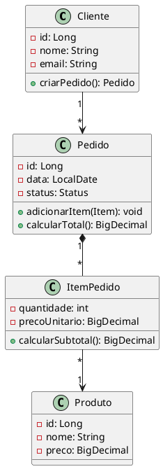
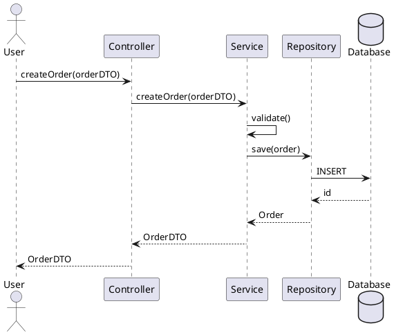

# 05.5 UML - Unified Modeling Language [TRANSVERSAL] 📐

## 🎯 Objetivo

Dominar **UML (Unified Modeling Language)** para **modelagem visual** de sistemas, incluindo **diagramas de classes**, **sequência**, **casos de uso**, **atividades** e **componentes** essenciais para comunicação técnica e documentação.

---

## 📚 O que é UML?

**UML** é uma **linguagem de modelagem visual padronizada** para:

- ✅ Documentar arquitetura de sistemas
- ✅ Comunicar design entre equipe
- ✅ Planejar antes de codificar
- ✅ Visualizar relacionamentos entre classes
- ✅ Mapear fluxos de processos

---

## 📊 Tipos de Diagramas UML

### Diagramas Estruturais (Estáticos)

1. **Class Diagram** - Classes, atributos, métodos, relacionamentos
2. **Object Diagram** - Instâncias de classes em tempo de execução
3. **Component Diagram** - Componentes do sistema e dependências
4. **Deployment Diagram** - Infraestrutura física (servidores, containers)
5. **Package Diagram** - Organização em pacotes/módulos

### Diagramas Comportamentais (Dinâmicos)

6. **Use Case Diagram** - Casos de uso e atores
7. **Sequence Diagram** - Interações entre objetos ao longo do tempo
8. **Activity Diagram** - Fluxo de atividades/processos
9. **State Machine Diagram** - Estados e transições de objetos
10. **Communication Diagram** - Comunicação entre objetos

---

## 🏗️ 1. Class Diagram (Diagrama de Classes)

### Elementos Básicos

```
┌─────────────────────┐
│   Cliente           │ ← Nome da classe
├─────────────────────┤
│ - id: Long          │ ← Atributos (- = private)
│ - nome: String      │
│ # email: String     │ (# = protected, + = public)
├─────────────────────┤
│ + getNome(): String │ ← Métodos
│ + setNome(String)   │
│ + validar(): boolean│
└─────────────────────┘
```

### Relacionamentos

```
Associação (simples)
┌─────────┐           ┌─────────┐
│ Pedido  │ ────────> │ Cliente │
└─────────┘           └─────────┘

Agregação (parte de, mas pode existir independente)
┌─────────┐           ┌──────────┐
│ Empresa │ ◇────────>│ Empregado│
└─────────┘           └──────────┘

Composição (parte de, não existe sem o todo)
┌─────────┐           ┌──────────┐
│ Pedido  │ ◆────────>│ ItemPedido│
└─────────┘           └──────────┘

Herança (generalização)
           ┌─────────┐
           │ Pessoa  │
           └────△────┘
                │
        ┌───────┴───────┐
        │               │
   ┌────────┐      ┌────────┐
   │ Cliente│      │Empregado│
   └────────┘      └────────┘

Implementação (interface)
           ┌──────────────┐
           │<<interface>> │
           │  Pagavel     │
           └──────△───────┘
                  │
                  │ (dotted line)
           ┌──────┴──────┐
           │ Pagamento   │
           └─────────────┘

Dependência (usa temporariamente)
┌──────────┐           ┌──────────┐
│ Service  │ ········> │   DTO    │
└──────────┘           └──────────┘
```

### Multiplicidade

```
1       - Exatamente um
0..1    - Zero ou um
*       - Zero ou muitos
1..*    - Um ou muitos
n       - Exatamente n

Exemplo:
┌─────────┐ 1     * ┌──────────┐
│ Cliente │────────┤│ Pedido   │
└─────────┘        │└──────────┘
                   └─ Cliente tem 0 ou muitos Pedidos
```

### Exemplo Completo: Sistema de Pedidos

```
                    ┌─────────────────────┐
                    │      Cliente        │
                    ├─────────────────────┤
                    │ - id: Long          │
                    │ - nome: String      │
                    │ - email: String     │
                    │ - cpf: String       │
                    ├─────────────────────┤
                    │ + criarPedido()     │
                    │ + consultarPedidos()│
                    └──────────┬──────────┘
                               │ 1
                               │
                               │ *
                    ┌──────────▼──────────┐
                    │      Pedido         │
                    ├─────────────────────┤
                    │ - id: Long          │
                    │ - data: LocalDate   │
                    │ - status: Status    │
                    │ - total: BigDecimal │
                    ├─────────────────────┤
                    │ + adicionarItem()   │
                    │ + calcularTotal()   │
                    │ + confirmar()       │
                    └──────────┬──────────┘
                               │ 1
                               │
                               │ *
                    ┌──────────▼──────────┐
                    │    ItemPedido       │◆ (composition)
                    ├─────────────────────┤
                    │ - quantidade: int   │
                    │ - precoUnitario     │
                    ├─────────────────────┤
                    │ + calcularSubtotal()│
                    └──────────┬──────────┘
                               │ *
                               │
                               │ 1
                    ┌──────────▼──────────┐
                    │      Produto        │
                    ├─────────────────────┤
                    │ - id: Long          │
                    │ - nome: String      │
                    │ - preco: BigDecimal │
                    │ - estoque: int      │
                    ├─────────────────────┤
                    │ + validarEstoque()  │
                    │ + atualizarEstoque()│
                    └─────────────────────┘
```

---

## 🔄 2. Sequence Diagram (Diagrama de Sequência)

### Elementos

```
Ator:     ┌─┐
          │ │ User
          └─┘

Objeto:   ┌──────────┐
          │:Controller│
          └────┬─────┘
               │ (lifeline)

Mensagem: ───────────>  (síncrona)
          ············> (assíncrona)
          <············ (retorno)

Ativação: ┃ (barra vertical = processamento)
```

### Exemplo: Criar Pedido

```
   User          Controller       Service        Repository       Database
    │                │               │                │               │
    │─createOrder()─>│               │                │               │
    │                │               │                │               │
    │                │─createOrder()─>│               │               │
    │                │               │               │               │
    │                │               │─validate()    │               │
    │                │               │               │               │
    │                │               │─save()───────>│               │
    │                │               │               │               │
    │                │               │               │─INSERT───────>│
    │                │               │               │               │
    │                │               │               │<──ID──────────│
    │                │               │               │               │
    │                │               │<──Order───────│               │
    │                │               │               │               │
    │                │<──OrderDTO────│               │               │
    │                │               │               │               │
    │<──OrderDTO─────│               │               │               │
    │                │               │               │               │
```

### Exemplo: Pagamento com Fallback

```
   Client         Gateway        PaymentService    CircuitBreaker    Fallback
    │                │                │                 │               │
    │─processPayment>│                │                 │               │
    │                │                │                 │               │
    │                │─processPayment>│                 │               │
    │                │                │                 │               │
    │                │                │─checkState()───>│               │
    │                │                │<──CLOSED────────│               │
    │                │                │                 │               │
    │                │                │─call API────────X (timeout)    │
    │                │                │                 │               │
    │                │                │─recordFailure()>│               │
    │                │                │<──OPEN──────────│               │
    │                │                │                 │               │
    │                │<──fallback()───────────────────────────────────>│
    │                │                │                 │               │
    │<──FallbackResp─│                │                 │               │
    │                │                │                 │               │
```

---

## 🎯 3. Use Case Diagram (Diagrama de Casos de Uso)

### Elementos

```
Ator:
    ┌─┐
    │ │ Cliente
    └─┘

Caso de Uso:
   ┌─────────────┐
   │ Fazer Login │
   └─────────────┘

Relacionamentos:
─────────> Associação (ator usa caso de uso)
········> <<include>> (sempre executado)
········> <<extend>> (condicionalmente executado)
```

### Exemplo: Sistema de E-commerce

```
                                 Sistema de E-commerce
    ┌────────────────────────────────────────────────────────┐
    │                                                          │
    │                  ┌──────────────┐                       │
    │                  │ Fazer Login  │                       │
    │                  └──────────────┘                       │
    │                          △                              │
    │                          │ <<include>>                  │
    │                          │                              │
┌─┐ │   ┌──────────────┐  ┌───┴────────────┐                │
│ │─┼──>│ Criar Pedido │──│ Validar Usuário│                │
└─┘ │   └──────────────┘  └────────────────┘                │
Cliente        │                                              │
    │          │ <<include>>                                 │
    │          │                                              │
    │          ▼                                              │
    │   ┌──────────────┐              ┌─────────────────┐   │
    │   │Calcular Frete│              │ Aplicar Cupom   │   │
    │   └──────────────┘              └─────────────────┘   │
    │                                          △              │
    │                                          │ <<extend>>   │
    │   ┌──────────────┐                      │              │
    │   │Efetuar Pagto │──────────────────────┘              │
    │   └──────────────┘                                     │
    │                                                          │
    │   ┌──────────────┐                                     │
    │   │Rastrear Pedido│                                    │
    │   └──────────────┘                                     │
    │                                                          │
    │                         ┌──────────────┐               │
    │                         │Gerenciar     │               │
 ┌─┐ │                        │Estoque       │               │
 │ │─┼───────────────────────>│              │               │
 └─┘ │                         └──────────────┘               │
Admin│                                                         │
    └────────────────────────────────────────────────────────┘
```

---

## 🔄 4. Activity Diagram (Diagrama de Atividades)

### Elementos

```
Início:      ●  (círculo preto)
Fim:         ◉  (círculo preto com borda)
Atividade:   ┌─────────┐
             │ Ação    │
             └─────────┘
Decisão:      ◇  (diamante)
Fork/Join:   ━━━ (barra horizontal)
```

### Exemplo: Processo de Compra

```
                         ●  Start
                         │
                         ▼
                  ┌─────────────┐
                  │ Selecionar  │
                  │  Produtos   │
                  └──────┬──────┘
                         │
                         ▼
                  ┌─────────────┐
                  │ Adicionar ao│
                  │  Carrinho   │
                  └──────┬──────┘
                         │
                         ▼
                      ◇─────◇
                  Continuar     Finalizar
                  Comprando?    Compra
                      │             │
                      │             ▼
                      │      ┌─────────────┐
                      │      │ Validar     │
                      │      │ Estoque     │
                      │      └──────┬──────┘
                      │             │
                      │             ▼
                      │         ◇─────◇
                      │     Estoque OK?
                      │      Não │  │ Sim
                      │          ▼  │
                      │  ┌──────────┐│
                      │  │ Notificar││
                      │  │Indisponível│
                      │  └──────────┘│
                      │              │
                      └──────────────┼───────┐
                                     │       │
                                     ▼       │
                              ┌─────────────┐│
                              │ Calcular    ││
                              │   Frete     ││
                              └──────┬──────┘│
                                     │       │
                              ━━━━━━━┷━━━━━━━┷━ Fork (paralelo)
                              ┃              ┃
                        ┌─────┴─────┐  ┌────┴────┐
                        │ Processar │  │Reservar │
                        │ Pagamento │  │Estoque  │
                        └─────┬─────┘  └────┬────┘
                              ┃              ┃
                              ━━━━━━━┯━━━━━━━┯━ Join
                                     │
                                     ▼
                               ◇─────────◇
                           Pagamento OK?
                            Não │    │ Sim
                                │    │
                                │    ▼
                                │ ┌──────────┐
                                │ │ Confirmar│
                                │ │  Pedido  │
                                │ └────┬─────┘
                                │      │
                                │      ▼
                                │ ┌──────────┐
                                │ │  Enviar  │
                                │ │  Email   │
                                │ └────┬─────┘
                                │      │
                                ▼      ▼
                          ┌──────────┐
                          │ Cancelar │
                          │  Pedido  │
                          └────┬─────┘
                               │
                               ▼
                               ◉  End
```

---

## 🏛️ 5. Component Diagram (Diagrama de Componentes)

### Exemplo: Arquitetura Microservices

```
┌─────────────────────────────────────────────────────────┐
│                    API Gateway                           │
│                  [Spring Cloud Gateway]                  │
└────────┬──────────────┬────────────────┬────────────────┘
         │              │                │
         ▼              ▼                ▼
┌────────────┐  ┌────────────┐  ┌────────────┐
│   User     │  │   Order    │  │  Payment   │
│  Service   │  │  Service   │  │  Service   │
│            │  │            │  │            │
│┌──────────┐│  │┌──────────┐│  │┌──────────┐│
││Controller││  ││Controller││  ││Controller││
│└────┬─────┘│  │└────┬─────┘│  │└────┬─────┘│
│     │      │  │     │      │  │     │      │
│┌────▼─────┐│  │┌────▼─────┐│  │┌────▼─────┐│
││ Service  ││  ││ Service  ││  ││ Service  ││
│└────┬─────┘│  │└────┬─────┘│  │└────┬─────┘│
│     │      │  │     │      │  │     │      │
│┌────▼─────┐│  │┌────▼─────┐│  │┌────▼─────┐│
││Repository││  ││Repository││  ││Repository││
│└────┬─────┘│  │└────┬─────┘│  │└────┬─────┘│
└─────┼──────┘  └─────┼──────┘  └─────┼──────┘
      │               │                │
      ▼               ▼                ▼
┌────────────┐  ┌────────────┐  ┌────────────┐
│ PostgreSQL │  │ PostgreSQL │  │   Redis    │
│    DB      │  │    DB      │  │   Cache    │
└────────────┘  └────────────┘  └────────────┘

         External Dependencies:
┌───────────────────────────────────────┐
│       ┌────────────┐  ┌────────────┐ │
│       │   Stripe   │  │  SendGrid  │ │
│       │ Payment API│  │ Email API  │ │
│       └────────────┘  └────────────┘ │
└───────────────────────────────────────┘
```

---

## 🚀 6. Deployment Diagram (Diagrama de Implantação)

### Exemplo: Kubernetes Deployment

```
┌─────────────────────────────────────────────────────────┐
│                  Kubernetes Cluster                      │
│                                                          │
│  ┌────────────────────────────────────────────────┐    │
│  │              Ingress Controller                 │    │
│  │                  [NGINX]                        │    │
│  └──────────────┬─────────────────┬────────────────┘    │
│                 │                 │                      │
│  ┌──────────────▼─────┐  ┌────────▼──────────┐         │
│  │  User Service Pod  │  │ Order Service Pod │         │
│  │                    │  │                   │         │
│  │ ┌────────────────┐ │  │ ┌───────────────┐ │         │
│  │ │   Container    │ │  │ │  Container    │ │         │
│  │ │  user-service  │ │  │ │ order-service │ │         │
│  │ │  [Java 17]     │ │  │ │  [Java 17]    │ │         │
│  │ └────────────────┘ │  │ └───────────────┘ │         │
│  └─────────┬──────────┘  └──────────┬────────┘         │
│            │                        │                   │
│  ┌─────────▼────────────────────────▼─────────┐        │
│  │          PostgreSQL StatefulSet            │        │
│  │                                             │        │
│  │  ┌──────────┐  ┌──────────┐  ┌──────────┐ │        │
│  │  │  Master  │  │ Replica1 │  │ Replica2 │ │        │
│  │  └──────────┘  └──────────┘  └──────────┘ │        │
│  │           [Persistent Volumes]             │        │
│  └────────────────────────────────────────────┘        │
│                                                          │
│  ┌─────────────────────────────────────────────────┐   │
│  │               Redis Cluster                      │   │
│  │  ┌────────┐  ┌────────┐  ┌────────┐            │   │
│  │  │ Master │  │ Slave1 │  │ Slave2 │            │   │
│  │  └────────┘  └────────┘  └────────┘            │   │
│  └─────────────────────────────────────────────────┘   │
└─────────────────────────────────────────────────────────┘

             External Services:
┌──────────────┐      ┌──────────────┐
│  AWS S3      │      │  Datadog     │
│  [Storage]   │      │  [Monitoring]│
└──────────────┘      └──────────────┘
```

---

## 🔧 Ferramentas UML

### Online (Free)

1. **PlantUML** - Texto para diagrama
2. **Draw.io (diagrams.net)** - Editor visual
3. **Mermaid** - Markdown-based diagrams
4. **Lucidchart** - Colaborativo (free tier)

### Desktop

5. **Visual Paradigm** - Completo (pago)
6. **Enterprise Architect** - Enterprise (pago)
7. **StarUML** - Desktop (freemium)

---

## 📝 PlantUML - Código para Diagrama

### Class Diagram



### Sequence Diagram



---

## 📋 Boas Práticas

### ✅ Recomendações

```
// ✅ Mantenha diagramas simples e focados
// Um diagrama por conceito/fluxo

// ✅ Use nomes significativos
Cliente, Pedido, ItemPedido (não C, P, IP)

// ✅ Documente relacionamentos
1..* (um para muitos), não apenas linha

// ✅ Use estereótipos quando relevante
<<interface>>, <<abstract>>, <<entity>>

// ✅ Atualize diagramas com código
// Diagramas desatualizados são piores que não ter

// ✅ Use ferramentas de código-para-diagrama
PlantUML, Mermaid (mantém sincronizado)

// ✅ Versionamento
// Diagramas no Git junto com código
```

### ❌ Anti-Patterns

```
// ❌ Diagramas gigantes incompreensíveis
// 50 classes em um diagrama

// ✅ Dividir em diagramas focados
// Um diagrama por módulo/domínio

// ❌ Diagramas desatualizados
// Código mudou, diagrama não

// ✅ Manter sincronizados ou gerar do código

// ❌ Detalhes excessivos
// Todos os getters/setters no diagrama

// ✅ Mostrar apenas métodos importantes

// ❌ Notação incorreta
// Setas erradas, multiplicidade errada

// ✅ Seguir padrão UML oficial
```

---

## 🎯 Quando Usar Cada Diagrama?

| Diagrama       | Quando Usar                                    |
| -------------- | ---------------------------------------------- |
| **Class**      | Design de domínio, estrutura de dados          |
| **Sequence**   | Fluxos complexos, integração entre componentes |
| **Use Case**   | Requisitos, comunicação com stakeholders       |
| **Activity**   | Processos de negócio, workflows                |
| **Component**  | Arquitetura de alto nível, microservices       |
| **Deployment** | Infraestrutura, DevOps, Kubernetes             |

---

## 📝 Resumo

**UML** fornece:

- ✅ **Comunicação**: Linguagem visual padronizada
- ✅ **Documentação**: Arquitetura e design
- ✅ **Planejamento**: Design antes de codificar
- ✅ **Manutenção**: Entender sistemas complexos
- ✅ **Onboarding**: Novos membros da equipe
- ✅ **Padronização**: Notação universal

**Diagramas mais usados:**

- **Class Diagram**: Estrutura de classes
- **Sequence Diagram**: Fluxos de interação
- **Use Case Diagram**: Requisitos funcionais
- **Component Diagram**: Arquitetura de sistemas

**Regra de ouro:** Use UML para **comunicar design complexo**, mantenha diagramas **atualizados** e **simples**, focando no que **agrega valor** à documentação.

---

**Última Atualização:** 2025-11-15  
**Nível:** TRANSVERSAL  
**Tempo Estimado:** 45 minutos
