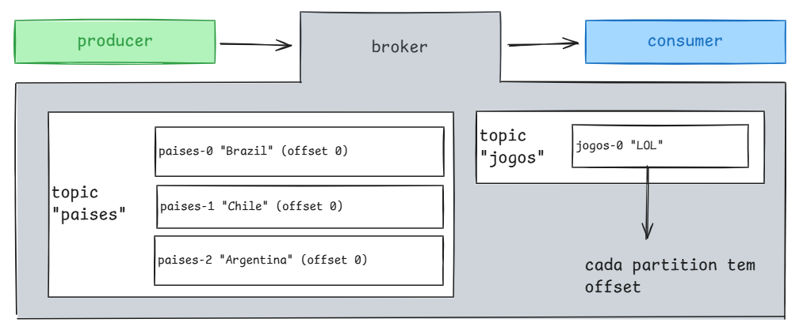

# Apache kafka

* **[Apache Kafka](https://kafka.apache.org/quickstart)**
* https://www.confluent.io/learn/spring-boot-kafka/

<!-- TODO colocar imagens, explicar termos -->

## 📚 Tabela de conteúdos

- [Dependência e configuração](#dependencia-e-configuração)
- [Produtor](#produtor)
- [Consumidor](#consumidor)
- [Tratamento de exceção](#tratamento-de-exceção)
- [Configuração](#configuração)

## Breve explicação
O Apache Kafka é uma plataforma de mensageria distribuída que permite a comunicação assíncrona entre sistemas por meio do envio e recebimento de mensagens. Ele atua como um intermediário entre quem produz (envia) e quem consome (processa) mensagens.

Uma analogia útil é a dos correios:

* Uma pessoa escreve uma carta (produtor), envia pelos correios (Kafka Broker), e outra pessoa a recebe (consumidor).

* Os correios organizam essas cartas por assunto, como países (tópicos), e dentro de cada país, por cidade (partições).


**Fluxo básico**
produtor -> broker (servidor Kafka) -> consumidor

**Principais conceitos**

| Termo         | Explicação                                                                 |
| ------------- | -------------------------------------------------------------------------- |
| **Broker**    | Servidor Kafka que armazena os dados e gerencia os tópicos e partições.    |
| **Cluster**   | Conjunto de brokers Kafka trabalhando juntos para garantir escalabilidade. |
| **Topic**     | Categoria ou nome lógico para agrupar mensagens (ex: `paises`).            |
| **Partition** | Subdivisão de um tópico para paralelizar o processamento.                  |
| **Offset**    | Posição única da mensagem dentro de uma partição, como um índice.          |
| **Producer**  | Componente que envia (publica) mensagens para um tópico.                   |
| **Consumer**  | Componente que lê (consome) mensagens de um tópico.                        |

**Exemplo ilustrativo**
Imagine o tópico paises, com as seguintes partições:
* paises-0 → mensagens sobre "Brasil"
* paises-1 → mensagens sobre "Chile"
* paises-2 → mensagens sobre "Argentina"

Cada mensagem tem um offset, como se fosse a posição na fila daquela partição. O consumidor usa o offset para saber até onde já leu.



## Dependência e configuração
Arquivo ``pom.xml``
```java
<dependency>
    <groupId>org.springframework.kafka</groupId>
    <artifactId>spring-kafka</artifactId>
</dependency>
```
Arquivo ``application.properties``
```sh
# Apache Kafka
spring.kafka.bootstrap-servers=host.docker.internal:9092
spring.kafka.admin.auto-create=true

## Consumer
spring.kafka.consumer.group-id=test-group
spring.kafka.consumer.auto-offset-reset=earliest
spring.kafka.consumer.key-deserializer=org.apache.kafka.common.serialization.StringDeserializer
spring.kafka.consumer.value-deserializer=org.apache.kafka.common.serialization.StringDeserializer

## Producer
spring.kafka.producer.key-serializer=org.apache.kafka.common.serialization.StringSerializer
spring.kafka.producer.value-serializer=org.apache.kafka.common.serialization.StringSerializer
app.kafka.topic=test-topic
```

* **bootstrap-servers** especifica qual o kafka broker(s) a aplicação vai se conectar
* **key-deserializer** converte a chave da mensagem recebida de byte[] para String
* **value-deserializer** converte a mensagem recebida de byte[] para String
* **group-id** define o grupo de consumidores, Kafka usa isso para rastrear o consumo
* **key-serializer** converte a chave da mensagem que será enviada de String para byte[]
* **value-serializer** converte a mensagem que será enviada de String para byte[]

## Produtor
```java
@Autowired
private KafkaTemplate<String, String> kafkaTemplate;

@Value("${app.kafka.topic}")
private String TOPIC;

public void sendMessage(String message) {
    kafkaTemplate.send(TOPIC, message)
            .thenAccept(result -> {
                var meta = result.getRecordMetadata();
                log.info("[Kafka] Message sent successfully: topic={}, partition={}, offset={}, message={}",
                        meta.topic(), meta.partition(), meta.offset(), message);
            })
            .exceptionally(ex -> {
                log.error("[Kafka] Failed to send message: {}", message, ex);
                return null;
            });
}
```
### Com reenvio
* **Configuração automática de reenvio**
* Kafka tentará reenviar a mensagem até 3 vezes se houver erro de rede ou erro transitório.
* Não cobre erros lógicos, como exceções em serialização.
* O produtor Kafka só faz retry automático em erros transitórios (por exemplo: TimeoutException, NetworkException) não cobre erros como falha de serialização, exceções de negócio, nem InvalidTopicException
```sh
## Producer
# ...
spring.kafka.producer.retries= 3
spring.kafka.producer.retry-backoff-ms= 1000 # tempo de espera entre tentativas
```

* **Configuração de um bean com Spring Retry**
* A alterna entre a política de reenvio via application.properties sem alterar código
```java
@Configuration
public class KafkaRetryConfig {

    @Value("${spring.kafka.producer.retries}")
    private int retries;

    @Value("${spring.kafka.producer.retry-backoff-ms}")
    private int backoff;

    @Value("${app.kafka.retry-policy}")
    private String retryPolicyType;

    @Bean
    public RetryTemplate retryTemplate() {
        RetryTemplate template = new RetryTemplate();

        // Política de tentativas
        SimpleRetryPolicy retryPolicy = new SimpleRetryPolicy();
        retryPolicy.setMaxAttempts(retries);

        // Política de espera entre tentativas
        BackOffPolicy backOffPolicy = "exponential".equalsIgnoreCase(retryPolicyType) ?
                getExponentialBackOffPolicy() :
                getFixedBackOffPolicy();

        template.setRetryPolicy(retryPolicy);
        template.setBackOffPolicy(backOffPolicy);

        return template;
    }

    private FixedBackOffPolicy getFixedBackOffPolicy() {
        var backOffPolicy = new FixedBackOffPolicy();
        backOffPolicy.setBackOffPeriod(backoff);

        return backOffPolicy;
    }

    private ExponentialBackOffPolicy getExponentialBackOffPolicy() {
        var backOffPolicy = new ExponentialBackOffPolicy();
        backOffPolicy.setInitialInterval(1000);
        backOffPolicy.setMultiplier(2.0);
        backOffPolicy.setMaxInterval(5000);

        return backOffPolicy;
    }

}
```
* **No service pegando o RetryTemplate customizado**
```java
    @Autowired
    private RetryTemplate retryTemplate;

    private void sendMessageWithRetry(String message) {
        RetryCallback<Void, RuntimeException> callback = context ->{
            int attempt = context.getRetryCount() + 1;
            log.info("[Kafka] Tentativa {} de envio da mensagem: {}", attempt, message);

            try {
                SendResult<String, String> result = kafkaTemplate.send(TOPIC, message).get(); // .get() para propagar exceções
                var meta = result.getRecordMetadata();
                log.info("[Kafka] Mensagem enviada com sucesso: topic={}, partition={}, offset={}",
                        meta.topic(), meta.partition(), meta.offset());
            } catch (Exception e) {
                log.warn("[Kafka] Erro ao tentar enviar mensagem na tentativa {}: {}", attempt, e.getMessage());
                throw new RuntimeException(e); // força o retry
            }

            return null;
        };

        RecoveryCallback<Void> recovery = context -> {
            // Callback final após todas as tentativas falharem
            log.error("[Kafka] Todas as tentativas de envio falharam para a mensagem: {}", message);
            return null;
        };

        retryTemplate.execute(callback, recovery);
    }
```

## Consumidor
Com tratamento de erro
```java
@KafkaListener(
        topics = "${app.kafka.topic}",
        groupId = "${spring.kafka.consumer.group-id}",
        errorHandler = "kafkaErrorHandler")
public void consume(String message) {
    try {
        if (message.contains("error")) {
            throw new RuntimeException("Failed processing message");
        }
        processMessage(message);
        log.info("[Kafka_consume] Consumed: {}", message);
    } catch (Exception e) {
        log.error("[Kafka_consume] Failed to process message: {}", message, e);
    }
}
```

Com configuração para tentar ler novamente
```java
@RetryableTopic(
        attempts = "3",
        backoff = @Backoff(delay = 2000),
        topicSuffixingStrategy = TopicSuffixingStrategy.SUFFIX_WITH_INDEX_VALUE
)
@KafkaListener(
        topics = "${app.kafka.topic}",
        groupId = "${spring.kafka.consumer.group-id}")
public void consumeWithRetry(String message) {
    try {
        if (message.contains("retry")) {
            throw new RuntimeException("Temporary failure");
        }
        processMessage(message);
        log.info("[Kafka_consumeWithRetry] Consumed: {}", message);
    } catch (Exception e) {
        log.error("[Kafka_consumeWithRetry] Failed to process message: {}", message, e);
    }
}
```

Busca mensagens do tópico
_OBS: apenas para fins administrativos ou testes, em produção é ``@KafkaListener``_
```java

@Autowired
private ConsumerFactory<String, String> consumerFactory;

public List<String> fetchMessagesFromKafka(int maxMessages) {
    List<String> messages = new ArrayList<>();

    try (KafkaConsumer<String, String> consumer = (KafkaConsumer<String, String>) consumerFactory.createConsumer()) {
        consumer.subscribe(List.of(topic));
        consumer.poll(Duration.ZERO); // força a atribuição de partições

        int count = 0;

        while (count < maxMessages) {
            var records = consumer.poll(Duration.ofSeconds(2));

            for (var record : records) {
                messages.add(record.value());
                if (++count >= maxMessages) break;
            }

            consumer.commitSync();

            if (records.isEmpty()) break; // se não veio nada, encerra
        }

    } catch (Exception e) {
        log.error("[Kafka] Erro ao buscar mensagens", e);
    }

    return messages;
}
```

## Tratamento de exceção
**O mais simples**
```java
public class KafkaErrorHandler {

    @Bean
    public ConsumerAwareListenerErrorHandler kafkaErrorHandler() {
        return (message, exception, consumer) -> {
            log.error("[Kafka Error] Failed to process message: {}", message.getPayload(), exception);
            return null; // You can log, send to DLQ, or handle accordingly
        };
    }
}
```
**Um pouco mais avançado com o envio para uma fila DLQ (Dead Letter Queue)**
```java
public class KafkaErrorHandler {

    @Autowired
    private KafkaTemplate<String, String> kafkaTemplate;

    @Bean
    public ConsumerAwareListenerErrorHandler kafkaErrorHandlerWithDLQ() {
        return (message, exception, consumer) -> {
            String payload = (String) message.getPayload();
            log.error("[Kafka Error] Failed to process message: {}", payload, exception);

            kafkaTemplate.send("my-dlq-topic", payload);
            return null;
        };
    }

}
```

**Mais avançado e recomendado**
* O Spring Kafka tenta reprocessar (retries internos do listener).
* Se todas as tentativas falharem, ele envia a mensagem automaticamente para um tópico DLQ.
```java
@Configuration
public class KafkaDLQConfig {

    @Autowired
    private KafkaTemplate<Object, Object> kafkaTemplate;

    @Bean
    public DeadLetterPublishingRecoverer recoverer() {
        return new DeadLetterPublishingRecoverer(kafkaTemplate,
                (record, ex) -> new TopicPartition(record.topic() + ".DLQ", record.partition()));
    }

    @Bean
    public DefaultErrorHandler errorHandler(DeadLetterPublishingRecoverer recoverer) {
        // Máximo de 3 tentativas + backoff exponencial
        ExponentialBackOff backOff = new ExponentialBackOff(1000L, 2.0);
        backOff.setMaxInterval(5000L);
    
        DefaultErrorHandler errorHandler = new DefaultErrorHandler(recoverer, backOff);
    
        // Você pode ignorar ou tratar exceções específicas também:
        // errorHandler.addNotRetryableExceptions(IllegalArgumentException.class);
    
        return errorHandler;
    }

}
```
* Vincule o ErrorHandler ao KafkaListenerContainerFactory
```java
@Configuration
public class KafkaListenerConfig {

    @Value("${spring.kafka.bootstrap-servers}")
    private String bootstrapServers;

    @Value("${spring.kafka.consumer.group-id}")
    private String groupId;

    @Bean
    public ConsumerFactory<String, String> consumerFactory() {
        Map<String, Object> props = new HashMap<>();
        props.put(ConsumerConfig.BOOTSTRAP_SERVERS_CONFIG, bootstrapServers);
        props.put(ConsumerConfig.GROUP_ID_CONFIG, groupId);
        props.put(ConsumerConfig.KEY_DESERIALIZER_CLASS_CONFIG, StringDeserializer.class);
        props.put(ConsumerConfig.VALUE_DESERIALIZER_CLASS_CONFIG, StringDeserializer.class);
        props.put(ConsumerConfig.AUTO_OFFSET_RESET_CONFIG, "earliest");
        return new DefaultKafkaConsumerFactory<>(props);
    }

    @Bean
    public ConcurrentKafkaListenerContainerFactory<String, String> kafkaListenerContainerFactory(
            ConsumerFactory<String, String> consumerFactory,
            DefaultErrorHandler errorHandler
    ) {
        ConcurrentKafkaListenerContainerFactory<String, String> factory =
                new ConcurrentKafkaListenerContainerFactory<>();

        factory.setConsumerFactory(consumerFactory);
        factory.setCommonErrorHandler(errorHandler);

        return factory;
    }
}

```

* Listener normal (sem precisar declarar errorHandler = ...)
```java
@KafkaListener(topics = "my-topic")
public void consume(String message) {
    // Simula erro
    if (message.contains("fail")) {
        throw new RuntimeException("Erro no processamento!");
    }

    log.info("Mensagem processada: {}", message);
}

// Optional
@KafkaListener(topics = "my-topic.DLQ")
public void listenDLQ(String message) {
    log.warn("Mensagem recebida na DLQ: {}", message);
}
```

| Vantagem                                 | Descrição                                |
| ---------------------------------------- | ---------------------------------------- |
| 🔁 Retenta automaticamente               | Com backoff                              |
| 🧯 Redireciona falhas críticas           | Evita perda de dados                     |
| 🔍 Ajuda na auditoria/debug              | O consumidor DLQ pode logar ou notificar |
| 🧩 Totalmente integrado com Spring Kafka | Sem código extra no seu serviço          |

------

## ✅ Reorganização:

1. **Separar as responsabilidades em três partes claras**:

   * 📦 **KafkaProducerConfig** → produção e retries manuais (se houver)
   * 📥 **KafkaConsumerConfig** → listeners + error handling (DefaultErrorHandler + DLQ)
   * ⚙️ **KafkaProperties** → centraliza tudo que vem do `application.yml`

2. **Reduzir o número de classes sem perder clareza**

3. **Manter extensível e fácil de dar manutenção**

---

## 📁 Organização final sugerida

### 1. ✅ `KafkaProperties.java`
Mais informações em [configuration-properties](./configuration-properties.md)

```java
@Component
@ConfigurationProperties(prefix = "app.kafka")
public class KafkaProperties {

    private String topic;
    private int retries;
    private int retryBackoffMs;
    private String retryPolicy;

    // Getters e setters
}
```

No `application.yml`:

```yaml
app:
  kafka:
    topic: my-topic
    retries: 3
    retry-backoff-ms: 1000
    retry-policy: exponential
```

---

### 2. ✅ `KafkaProducerConfig.java`

```java
@Configuration
public class KafkaProducerConfig {

    private final KafkaProperties props;

    public KafkaProducerConfig(KafkaProperties props) {
        this.props = props;
    }

    @Bean
    public RetryTemplate retryTemplate() {
        RetryTemplate template = new RetryTemplate();

        SimpleRetryPolicy retryPolicy = new SimpleRetryPolicy();
        retryPolicy.setMaxAttempts(props.getRetries());

        BackOffPolicy backOffPolicy = "exponential".equalsIgnoreCase(props.getRetryPolicy()) ?
                getExponentialBackOffPolicy() : getFixedBackOffPolicy();

        template.setRetryPolicy(retryPolicy);
        template.setBackOffPolicy(backOffPolicy);

        return template;
    }

    private FixedBackOffPolicy getFixedBackOffPolicy() {
        FixedBackOffPolicy policy = new FixedBackOffPolicy();
        policy.setBackOffPeriod(props.getRetryBackoffMs());
        return policy;
    }

    private ExponentialBackOffPolicy getExponentialBackOffPolicy() {
        ExponentialBackOffPolicy policy = new ExponentialBackOffPolicy();
        policy.setInitialInterval(1000);
        policy.setMultiplier(2.0);
        policy.setMaxInterval(5000);
        return policy;
    }
}
```

---

### 3. ✅ `KafkaConsumerConfig.java`

```java
@Configuration
public class KafkaConsumerConfig {

    private final KafkaTemplate<Object, Object> kafkaTemplate;

    public KafkaConsumerConfig(KafkaTemplate<Object, Object> kafkaTemplate) {
        this.kafkaTemplate = kafkaTemplate;
    }

    @Bean
    public DeadLetterPublishingRecoverer deadLetterPublishingRecoverer() {
        return new DeadLetterPublishingRecoverer(kafkaTemplate,
                (record, ex) -> new TopicPartition(record.topic() + ".DLQ", record.partition()));
    }

    @Bean
    public DefaultErrorHandler errorHandler(DeadLetterPublishingRecoverer recoverer) {
        ExponentialBackOff backOff = new ExponentialBackOff(1000L, 2.0);
        backOff.setMaxInterval(5000L);

        return new DefaultErrorHandler(recoverer, backOff);
    }

    @Bean
    public ConsumerFactory<String, String> consumerFactory() {
        Map<String, Object> props = new HashMap<>();
        props.put(ConsumerConfig.BOOTSTRAP_SERVERS_CONFIG, bootstrapServers);
        props.put(ConsumerConfig.GROUP_ID_CONFIG, groupId);
        props.put(ConsumerConfig.KEY_DESERIALIZER_CLASS_CONFIG, StringDeserializer.class);
        props.put(ConsumerConfig.VALUE_DESERIALIZER_CLASS_CONFIG, StringDeserializer.class);
        props.put(ConsumerConfig.AUTO_OFFSET_RESET_CONFIG, "earliest");
        return new DefaultKafkaConsumerFactory<>(props);
    }

    @Bean
    public ConcurrentKafkaListenerContainerFactory<String, String> kafkaListenerContainerFactory(
            ConsumerFactory<String, String> consumerFactory,
            DefaultErrorHandler errorHandler) {

        ConcurrentKafkaListenerContainerFactory<String, String> factory =
                new ConcurrentKafkaListenerContainerFactory<>();

        factory.setConsumerFactory(consumerFactory);
        factory.setCommonErrorHandler(errorHandler);

        return factory;
    }
}
```

---

### 4. ✅ `KafkaProducerService.java` (serviço com retry opcional)

```java
@Service
public class KafkaProducerService {

    private final KafkaTemplate<String, String> kafkaTemplate;
    private final RetryTemplate retryTemplate;
    private final KafkaProperties props;

    public KafkaProducerService(KafkaTemplate<String, String> kafkaTemplate,
                                RetryTemplate retryTemplate,
                                KafkaProperties props) {
        this.kafkaTemplate = kafkaTemplate;
        this.retryTemplate = retryTemplate;
        this.props = props;
    }

    public void send(String message) {
        kafkaTemplate.send(props.getTopic(), message)
            .thenAccept(result -> log.info("[Kafka] Enviado com sucesso: {}", message))
            .exceptionally(ex -> {
                log.error("[Kafka] Falha ao enviar: {}", message, ex);
                return null;
            });
    }

    public void sendWithRetry(String message) {
        retryTemplate.execute(context -> {
            log.info("[Kafka] Tentando enviar (tentativa {}): {}", context.getRetryCount() + 1, message);
            kafkaTemplate.send(props.getTopic(), message).get();
            return null;
        }, context -> {
            log.error("[Kafka] Todas as tentativas falharam: {}", message);
            return null;
        });
    }
}
```

---

### 5. ✅ Listener de consumo

```java
@KafkaListener(topics = "${app.kafka.topic}")
public void consume(String message) {
    log.info("Consumido: {}", message);

    if (message.contains("erro")) {
        throw new RuntimeException("Erro proposital");
    }
}
```

---

### 6. ✅ Listener da DLQ

```java
@KafkaListener(topics = "${app.kafka.topic}.DLQ")
public void consumeDlq(String message) {
    log.warn("Mensagem foi para a DLQ: {}", message);
}
```

---

## ✅ Resultado

📦 Organização final:

```
src/main/java/
├── config/
│   ├── KafkaProducerConfig.java
│   ├── KafkaConsumerConfig.java
│   └── KafkaProperties.java
├── service/
│   └── KafkaProducerService.java
└── listener/
    ├── MyKafkaListener.java
    └── DlqKafkaListener.java
```

---

## ✅ Conclusão

Você fica com:

* Configurações separadas por responsabilidade (produtor, consumidor, propriedades)
* Zero duplicação
* DLQ e retry funcionais
* Manutenção e leitura muito mais simples
