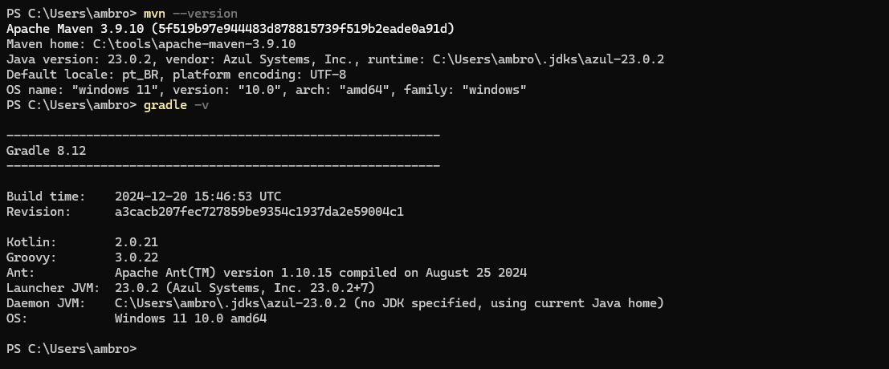

# Maven e Gradle

- **[Maven](https://maven.apache.org/)**
- **[Gradle](https://docs.gradle.org/current/userguide/userguide.html)**

## 📚 Tabela de conteúdos

- [📦 Maven build e plugins](#maven-build-e-plugins)
  - [Plugin Spring Boot para construir JARs executáveis](#plugin-spring-boot-para-construir-jars-executáveis)
  - [Plugin do compilador Maven com processadores de anotação para Lombok e MapStruct](#plugin-do-compilador-maven-com-processadores-de-anotação-para-lombok-e-mapstruct)
  - [Carrega propriedades de dependência](#carrega-propriedades-de-dependência-podem-ser-removidas-se-não-forem-utilizadas)
  - [Executa testes unitários e configura o agente Java Mockito](#executa-testes-unitários-e-configura-o-agente-java-mockito-se-necessário)
  - [Plugin JaCoCo para medir a cobertura de código, mínimo de 80%](#plugin-jacoco-para-medir-a-cobertura-de-código-mínimo-de-80)
  - [Copia o relatório JaCoCo gerado para a pasta de recursos estáticos para acesso frontend](#copia-o-relatório-jacoco-gerado-para-a-pasta-de-recursos-estáticos-para-acesso-frontend)

## Instalação

Add the bin directory to the PATH environment variable

- [Maven](https://maven.apache.org/install.html)
- [Gradle](https://docs.gradle.org/current/userguide/installation.html#ex-installing-manually)



## Resumo dos comandos

Certo! Aqui está uma tabela comparando os comandos Maven e Gradle para tarefas comuns de construção:

---

## Comandos Maven vs. Gradle

| Tarefa Comum               | Comando Maven          | Comando Gradle                     | Descrição                                                                                                                               |
| :------------------------- | :--------------------- | :--------------------------------- | :-------------------------------------------------------------------------------------------------------------------------------------- |
| **Construir Projeto**      | `mvn clean install`    | `gradlew build`                    | Compila o código-fonte, executa testes, empacota o projeto (JAR/WAR), e o instala no repositório Maven local.                           |
| **Limpar Projeto**         | `mvn clean`            | `gradlew clean`                    | Remove os artefatos de construção gerados, como classes compiladas e arquivos de pacote, da pasta `target` (Maven) ou `build` (Gradle). |
| **Executar Testes**        | `mvn test`             | `gradlew test`                     | Executa todos os testes unitários e de integração definidos no projeto.                                                                 |
| **Gerar WAR/JAR**          | `mvn package`          | `gradlew bootJar` ou `gradlew war` | Empacota o projeto em um arquivo `.jar` ou `.war` para implantação. (Para Spring Boot, `bootJar` é o mais comum).                       |
| **Atualizar Dependências** | `mvn clean install -U` | `gradlew --refresh-dependencies`   | Força a atualização de todas as dependências do projeto.                                                                                |

---

## Gradle vs Gradlew

A diferença entre **`gradle`** e **`gradlew`** (ou **`./gradlew`** em sistemas Unix/Linux/macOS e **`gradlew.bat`** no Windows) é crucial para um desenvolvimento colaborativo e consistente.

---

### Quando usar `gradle`

Você usa o comando `gradle` quando tem uma **instalação global do Gradle** na sua máquina. Isso significa que o Gradle foi instalado separadamente (por exemplo, via SDKMAN!, Homebrew ou download manual) e está disponível no seu PATH.

**Uso principal:**

- **Projetos pessoais ou de prototipagem:** Se você está trabalhando em um projeto rápido ou apenas testando algo e não se importa muito com a consistência da versão do Gradle entre diferentes ambientes.
- **Inicializar um novo projeto com o Wrapper:** Você pode usar `gradle init` para criar um novo projeto Gradle, que **automaticamente configura o Wrapper** para você.
- **Gerenciar o Wrapper de um projeto existente:** Você pode usar `gradle wrapper` para atualizar ou reconfigurar o Wrapper em um projeto existente.

**Desvantagens:**

- **Inconsistência de versão:** Se diferentes desenvolvedores (ou até mesmo você em momentos diferentes) usam versões diferentes do Gradle, isso pode levar a builds que funcionam em uma máquina, mas não em outra, devido a incompatibilidades.
- **Dependência de instalação local:** Qualquer um que queira construir seu projeto precisa ter o Gradle instalado localmente e na versão correta.

---

### Quando usar `gradlew` (Gradle Wrapper)

O **Gradle Wrapper** é um script (ou conjunto de scripts e arquivos de configuração) que **vem incluído no projeto Gradle**. Ele é a maneira **recomendada** de executar builds Gradle. Você o executa usando `./gradlew` (ou `gradlew.bat` no Windows) a partir da raiz do seu projeto.

Quando você executa `gradlew` pela primeira vez em um projeto, ele verifica se a versão específica do Gradle definida no arquivo `gradle/wrapper/gradle-wrapper.properties` do projeto já está instalada localmente (em um cache). Se não estiver, ele a **baixa automaticamente** e a utiliza para a construção.

**Vantagens principais:**

- **Padronização da versão:** Garante que todos os desenvolvedores, sistemas de integração contínua (CI/CD) e qualquer ambiente de build usem **exatamente a mesma versão do Gradle** definida pelo projeto. Isso elimina problemas de "funciona na minha máquina".
- **Não requer instalação global do Gradle:** Novos colaboradores podem clonar o projeto e executar `gradlew build` imediatamente, sem precisar instalar o Gradle manualmente. O Wrapper se encarrega de baixar a versão correta.
- **Bugs de compatibilidade minimizados:** Como a versão é fixada, você evita surpresas devido a mudanças de comportamento entre diferentes versões do Gradle.
- **Atualização simplificada:** Se você precisar atualizar a versão do Gradle para o projeto, basta alterar a versão no arquivo `gradle-wrapper.properties` e fazer o commit. Todos que puxarem as mudanças usarão a nova versão automaticamente.
- **Portabilidade:** O projeto se torna mais autônomo e fácil de ser construído em diferentes máquinas e ambientes.

---

### Em resumo: **Sempre use `gradlew` (o Gradle Wrapper) para construir seus projetos Gradle.**

É a melhor prática para garantir consistência, facilitar a colaboração e tornar seus builds mais robustos e portáteis. O comando `gradle` (instalação global) deve ser reservado para tarefas como configurar o Wrapper inicial de um projeto ou para uso muito pontual e não compartilhado.

## 📦 Maven build e plugins

A ordem apresentada a seguir é importante, especialmente na configuração do plugin que envolve Lombok e MapStruct.

### Plugin Spring Boot para construir JARs executáveis

```xml
<plugin>
    <groupId>org.springframework.boot</groupId>
    <artifactId>spring-boot-maven-plugin</artifactId>
    <version>${spring.boot.maven.plugin}</version>
    <executions>
        <execution>
            <goals>
                <goal>repackage</goal>
            </goals>
        </execution>
    </executions>
</plugin>
```

### Plugin do compilador Maven com processadores de anotação para Lombok e MapStruct

```xml
<plugin>
    <groupId>org.apache.maven.plugins</groupId>
    <artifactId>maven-compiler-plugin</artifactId>
    <configuration>
        <source>${java.version}</source>
        <target>${java.version}</target>
        <generatedSourcesDirectory>${project.build.directory}/generated-sources/annotations
        </generatedSourcesDirectory>
        <annotationProcessorPaths>
            <path>
                <groupId>org.projectlombok</groupId>
                <artifactId>lombok</artifactId>
                <version>${lombok.version}</version>
            </path>
            <path>
                <groupId>org.mapstruct</groupId>
                <artifactId>mapstruct-processor</artifactId>
                <version>${mapstruct.version}</version>
            </path>
        </annotationProcessorPaths>
    </configuration>
</plugin>
```

### Carrega propriedades de dependência (podem ser removidas se não forem utilizadas)

```xml
<plugin>
    <groupId>org.apache.maven.plugins</groupId>
    <artifactId>maven-dependency-plugin</artifactId>
    <executions>
        <execution>
            <goals>
                <goal>properties</goal>
            </goals>
        </execution>
    </executions>
</plugin>
```

### Executa testes unitários e configura o agente Java Mockito (se necessário)

```xml
<plugin>
    <groupId>org.apache.maven.plugins</groupId>
    <artifactId>maven-surefire-plugin</artifactId>
    <configuration>
        <argLine>
            -javaagent:${settings.localRepository}/org/mockito/mockito-core/${mockito.version}/mockito-core-${mockito.version}.jar
        </argLine>
    </configuration>
</plugin>
```

### Plugin JaCoCo para medir a cobertura de código, mínimo de 80%

```xml
<plugin>
    <groupId>org.jacoco</groupId>
    <artifactId>jacoco-maven-plugin</artifactId>
    <version>${jacoco.version}</version>
    <executions>
        <!-- Prepares the JaCoCo agent before running tests -->
        <execution>
            <goals>
                <goal>prepare-agent</goal>
            </goals>
            <configuration>
                <excludes>
                    <exclude>org/jcp/xml/**</exclude>
                    <exclude>com/sun/**</exclude>
                    <exclude>sun/*</exclude>
                    <exclude>java/*</exclude>
                    <exclude>jdk/*</exclude>
                    <exclude>javax/*</exclude>
                    <exclude>**/*Application.class</exclude>
                    <exclude>**/*$HibernateInstantiator.class</exclude>
                    <exclude>**/*$Proxy*.class</exclude>
                    <exclude>**/*$HibernateProxy*.class</exclude>
                    <exclude>**/*$EnhancerBySpringCGLIB*.class</exclude>
                </excludes>
            </configuration>
        </execution>

        <!-- Generates HTML report after running tests -->
        <execution>
            <id>report</id>
            <phase>verify</phase>
            <goals>
                <goal>report</goal>
            </goals>
            <configuration>
                <excludes>
                    <exclude>**/models/**</exclude>
                    <exclude>**/entities/**</exclude>
                    <exclude>**/enums/**</exclude>
                    <exclude>**/exceptions/**</exclude>
                    <exclude>**/interfaces/**</exclude>
                    <exclude>**/*Application.class</exclude>
                </excludes>
            </configuration>
        </execution>

        <!-- Enforces a minimum coverage threshold during build -->
        <execution>
            <id>check</id>
            <goals>
                <goal>check</goal>
            </goals>
            <configuration>
                <rules>
                    <rule>
                        <element>BUNDLE</element>
                        <limits>
                            <limit>
                                <counter>INSTRUCTION</counter>
                                <value>COVEREDRATIO</value>
                                <minimum>0.80</minimum>
                            </limit>
                        </limits>
                    </rule>
                </rules>
                <excludes>
                    <exclude>**/models/**</exclude>
                    <exclude>**/entities/**</exclude>
                    <exclude>**/enums/**</exclude>
                    <exclude>**/exceptions/**</exclude>
                    <exclude>**/interfaces/**</exclude>
                    <exclude>**/*Application.class</exclude>
                </excludes>
            </configuration>
        </execution>
    </executions>
</plugin>
```

### Copia o relatório JaCoCo gerado para a pasta de recursos estáticos para acesso frontend

```xml
<plugin>
    <groupId>org.apache.maven.plugins</groupId>
    <artifactId>maven-resources-plugin</artifactId>
    <version>${maven.resources.plugin.version}</version>
    <executions>
        <execution>
            <id>copy-jacoco-report</id>
            <phase>prepare-package</phase>
            <goals>
                <goal>copy-resources</goal>
            </goals>
            <configuration>
                <outputDirectory>${project.basedir}/src/main/resources/static/jacoco</outputDirectory>
                <resources>
                    <resource>
                        <directory>${project.build.directory}/site/jacoco</directory>
                        <filtering>false</filtering>
                    </resource>
                </resources>
            </configuration>
        </execution>
    </executions>
</plugin>
```
