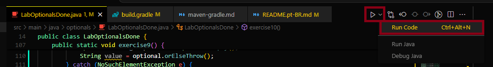
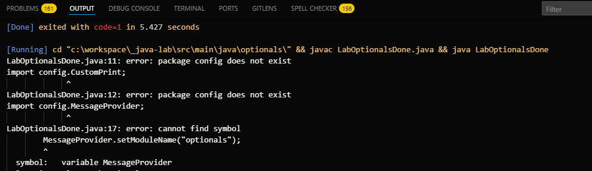
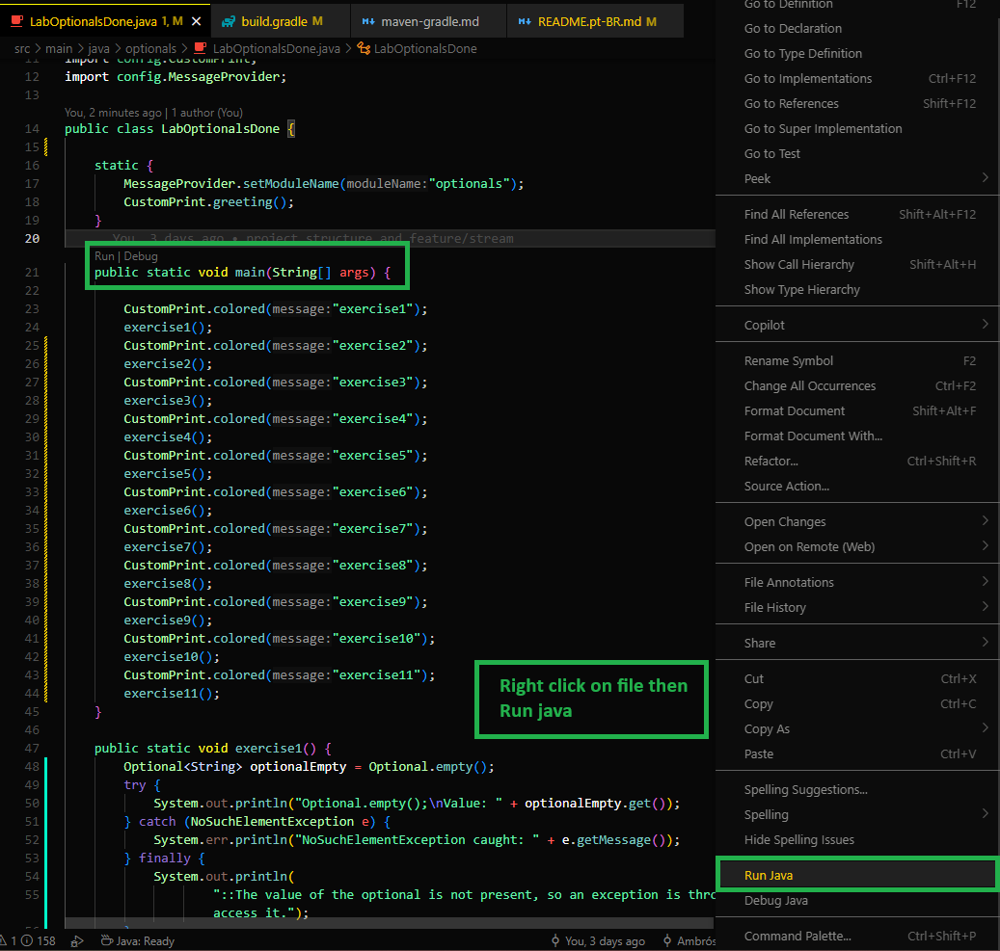
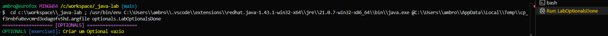

# VS CODE

## Descrição

Estava com dificuldades para executar classes Java em um projeto gerenciado pelo `Gradle` no Visual Studio Code. O erro que consistentemente apareceu é _package [nome_do_pacote] does not exist_ ao tentar importar classes de outros pacotes dentro do mesmo projeto (ex: import config.CustomPrint;).

O build do projeto via `./gradlew build` no terminal é executado com sucesso, indicando que a estrutura do projeto e as dependências são reconhecidas pelo Gradle. No entanto, ao tentar rodar o arquivo Java diretamente no VS Code (utilizando o botão 'Run Code' da extensão Code Runner ou comandos manuais javac e java no terminal integrado), o erro de pacote persiste.

Isso sugere que o ambiente de execução fora do `Gradle` não está configurando corretamente o classpath para incluir os pacotes internos do projeto, resultando na impossibilidade de resolver as referências entre as classes.

**Plugins instalados:**
**[Code Runner](https://marketplace.visualstudio.com/items?itemName=formulahendry.code-runner)** e **[Extension Pack for Java](https://marketplace.visualstudio.com/items?itemName=vscjava.vscode-java-pack)**

## Estrutura

```sh
java-lab/
├── build.gradle
├── settings.gradle
├── gradlew
├── gradlew.bat
├── gradle/
├── src/
│   ├── test/
│   ├── main/
│       └── java/
│           ├── config/
│           ├── optionals/
//...
```

## Solução

**ERRO: Code Runner**
Ao executar o arquivo pelo ícone na barra superior:

mostra um erro de não achar arquivos em outro pacote:


**Code Runner** é conveniente para rodar arquivos individuais rapidamente, mas ele não integra com sistemas de build como o `Gradle` ou `Maven`. É por isso que está com erro _package config does not exist_ quando tenta rodar um arquivo Java com ele, pois ele executa o `javac` e `java` diretamente, sem considerar o classpath do projeto `Gradle`.

**SUCESSO: Extension Pack for Java**
Quando você abre a pasta raiz do seu projeto `Gradle` no `VS Code` e tem a "Extension Pack for Java" instalada, você verá botões de "Run" e "Debug" diretamente acima do método main nas suas classes Java (estes são os "CodeLens"). Esses botões usam o `Gradle` por baixo dos panos e resolverão corretamente o classpath e as dependências.

Ao executar o arquivo:

executado com sucesso:


## Desativar o `Code Runner` para Java

### Opção 1: Desabilitar o Code Runner para Linguagens Específicas (Recomendado)

Esta é a melhor opção, pois você mantém o Code Runner ativo para outras linguagens (se usar) e apenas o desabilita para Java, onde a extensão Java do VS Code já oferece uma integração superior com Gradle/Maven.

1.  **Abra as Configurações do VS Code:**
    - Vá em `File` \> `Preferences` \> `Settings` (ou pressione `Ctrl+,`).
2.  **Procure por "Code Runner: Executor Map":**
    - No campo de busca das configurações, digite `code-runner.executorMap`.
3.  **Edite em `settings.json`:**
    - Você verá uma opção "Edit in settings.json" ou um ícone de `{}` para abrir o arquivo JSON. Clique nele.
4.  **Remova ou Comente a Entrada "java":**
    - No seu arquivo `settings.json`, você verá algo como:
      ```json
      {
        "code-runner.executorMap": {
          "javascript": "node",
          "python": "python",
          "java": "cd $dir && javac $fileName && java $fileNameWithoutExt" // Esta é a linha para Java
          // ... outras linguagens
        }
      }
      ```
    - Você pode **remover a linha `"java": "..."`** completamente ou **comentá-la** adicionando `//` na frente, assim:
      ```json
      {
        "code-runner.executorMap": {
          "javascript": "node",
          "python": "python"
          //"java": "cd $dir && javac $fileName && java $fileNameWithoutExt", // Linha comentada para desativar o Code Runner para Java
          // ... outras linguagens
        }
      }
      ```
5.  **Salve o arquivo `settings.json`.**

Após salvar, o Code Runner não tentará mais executar arquivos `.java`. O ícone de "play" na barra de título ainda pode aparecer, mas ao clicar nele para um arquivo Java, ele não fará nada ou exibirá um erro informando que não há um executor configurado para Java.

---

### Opção 2: Desabilitar Completamente o Plugin Code Runner

Se você não usa o Code Runner para nenhuma linguagem e prefere que ele não apareça, você pode simplesmente desabilitar a extensão.

1.  **Vá para a Visualização de Extensões:**
    - Clique no ícone de "Extensões" na barra de atividades lateral do VS Code (o ícone de quatro quadrados).
    - Ou pressione `Ctrl+Shift+X`.
2.  **Procure por "Code Runner":**
    - Na barra de pesquisa de extensões, digite `Code Runner`.
3.  **Desabilitar ou Desinstalar:**
    - Clique na extensão "Code Runner" (geralmente por Jun Han).
    - Clique no botão "Disable" (Desabilitar) para desativá-lo temporariamente, ou "Uninstall" (Desinstalar) se não pretende usá-lo novamente.

Ao desabilitar a extensão, o ícone de "play" e todas as funcionalidades do Code Runner desaparecerão.

---
